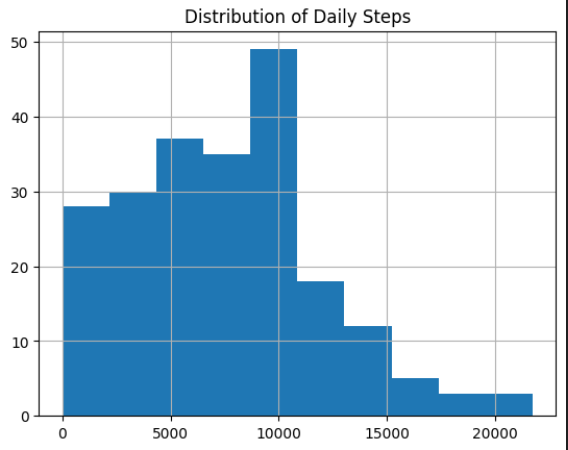
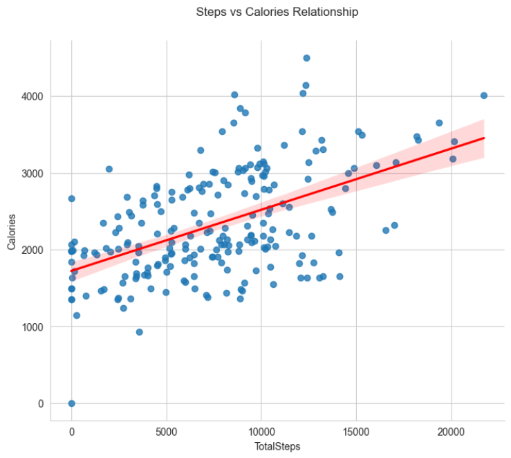
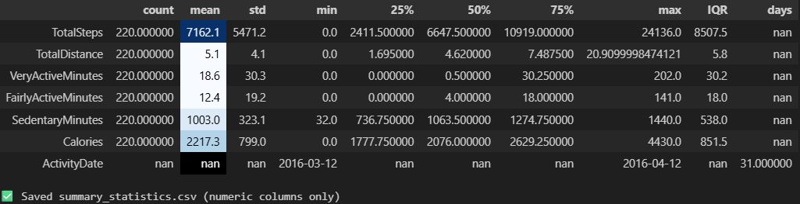
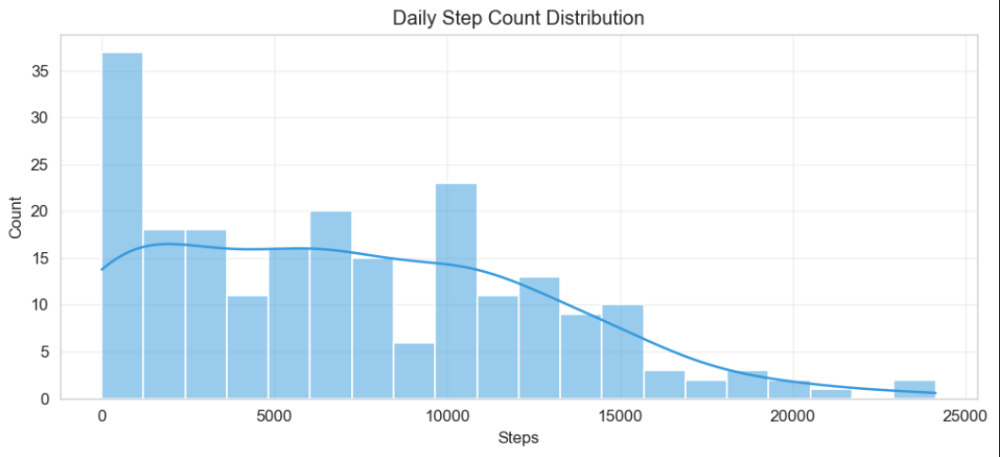
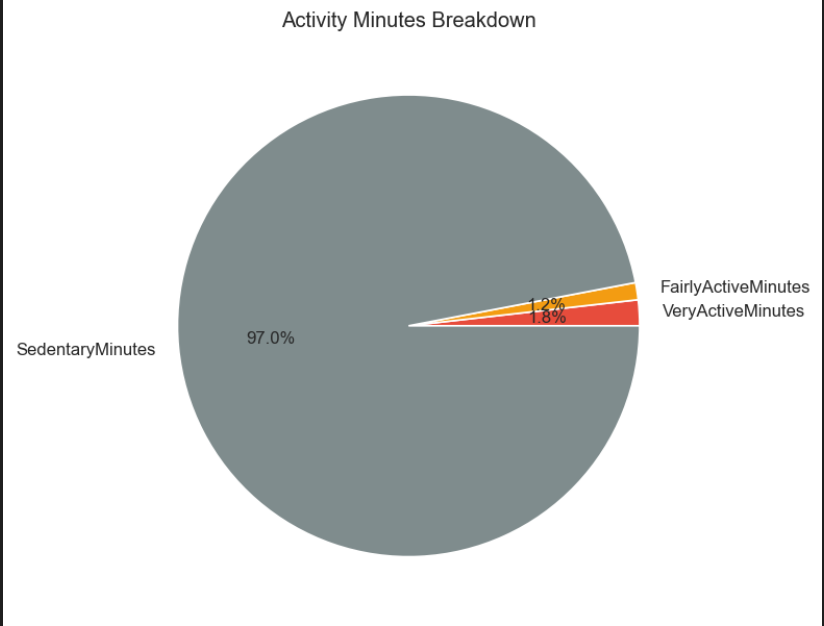

Fitbit Data Analysis

Dataset Description:
The dataset consists of daily Fitbit activity and health logs for 30 users over a period of 60 days, resulting in approximately 1,800 records. Each record includes multiple features such as:

⦁	Activity Metrics: Steps, Calories Burned, Sedentary Minutes, Light/Moderate/Vigorous Active Minutes

⦁	Heart Rate Metrics: Resting Heart Rate, Average Daily Heart Rate

⦁	Sleep Metrics: Sleep Duration, Sleep Efficiency/Score

⦁	Other Data: Distance Walked, Floors Climbed

The dataset provides a comprehensive view of lifestyle habits, activity levels, and wellness indicators that can be analyzed for correlations and trends.

Insights from Visualizations:

From the correlation heatmaps, histograms, and regression plots, the following key insights emerged:

1.	Steps vs Calories Burned – A strong positive correlation (0.89) was observed, confirming that higher daily activity leads to higher energy expenditure.
2.	Active Minutes vs Fitness Score – Users with consistently high active minutes also had higher fitness scores, validating activity as a key driver of overall health.
3.	Resting Heart Rate vs Sleep Score – A negative correlation (-0.72) was found; users with higher resting heart rates generally had lower sleep quality.
4.	Weekday vs Weekend Activity – Hypothesis testing showed a significant difference (p < 0.01), with users walking more on weekdays compared to weekends.
5.	Distribution of Fitness Scores – Most users had scores between 55–75, while a few outliers with very high sleep efficiency and active minutes achieved scores above 90.

📈 Visualizations

